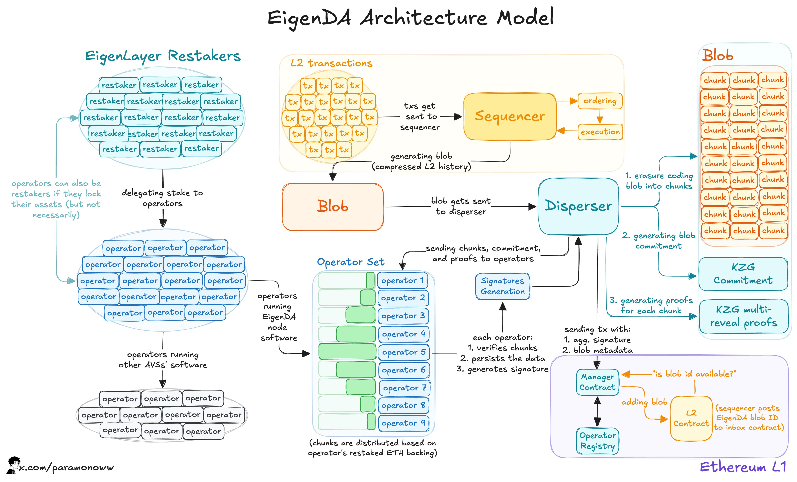

# EigenLayer

EigenLayer enhances Ethereum's modularity by enabling developers to build applications that leverage Ethereum's security while introducing customizable layers for specific needs. Here we focus on **EigenDA**, the data availability solution that enables MegaETH's breakthrough performance.

### Understanding Data Availability

**Data availability (DA)** ensures all transaction data is publicly accessible so anyone can verify state changes. It's essentially the blockchain "showing its work" - without it, operators could manipulate records like a centralized database.

**Who needs DA solutions?**

* Blockchains that outsource consensus to Ethereum (like MegaETH)
* High-performance rollups exceeding Ethereum's native capacity
* Applications requiring more than \~400 TPS globally

### Ethereum's DA Limitations

Since the **Dencun upgrade**, Ethereum uses "blobs" for rollup data:

* **Current capacity**: 64 KB/s (6 blobs × 128KB ÷ 12 seconds)
* **Supports**: \~100 Megagas/s & \~400 TPS **shared across ALL rollups**
* **Base alone uses**: 25-30% of blob space at just 120 TPS
* **Blob pricing**: Increases exponentially above target to prevent congestion
* **Future roadmap**: Even with PeerDAS (2026), only 48 blobs expected

**The problem**: MegaETH targets 10 Gigagas/s and 100K TPS, requiring \~20MB/s of DA throughput - **300x more than Ethereum provides**.

<figure><figcaption></figcaption></figure>

### EigenDA: Breaking Through Limits

EigenDA solves this bottleneck with a fundamentally different architecture:

**Current Performance**:

* **15 MB/s throughput** (live on mainnet)
* **50 MB/s** on V2 testnet
* **800x Ethereum's capacity**
* Supports **250,000+ ERC-20 transfers/second**

**Key Innovations**:

* **Horizontal scaling**: Capacity increases as operators join
* **Erasure-coded sharding**: Data split across operators with KZG commitments
* **Cryptographic proofs**: Operators prove data authenticity
* **Redundancy**: Reconstructs data even if some shards missing

### How MegaETH Uses EigenDA

The integration creates a dual-layer approach:

1. **Sequencer** submits transaction batches to EigenDA
2. Data is **erasure-coded** and distributed across operators
3. Operators validate and return **BLS signatures**
4. Signatures aggregate into a **DA Certificate**
5. Certificate verified on Ethereum via **EigenDA Verifier contract**
6. MegaETH posts **State Root** to Ethereum for security anchoring

**Result**: Ethereum's security + EigenDA's throughput = Real-time blockchain performance

### Why This Matters

* **No compromises**: Full Ethereum security with 100K+ TPS capability
* **Future-ready**: EigenDA roadmap aligns with MegaETH's scaling trajectory
* **Enables new applications**: Performance previously impossible on-chain
* **Slashing mechanism**: Financial penalties ensure operator reliability

### Resources

* [ENDGAME: How we break performance limits with EigenDA](https://x.com/megaeth_labs/status/1925569342391161333)
* [EigenDA technical overview by Sreeram Kannan](https://x.com/sreeramkannan/status/1741252007745528020)
* [MegaETH leveraging best-in-class infrastructure](https://x.com/megaeth_labs/status/1912918682545819734)
* [Blob aggregation visualization](https://x.com/paramonoww/status/1912111750209786241)

<figure><figcaption>
<a href="https://x.com/paramonoww/status/1879500495641006082">Twitter thread</a>
</figcaption></figure>
