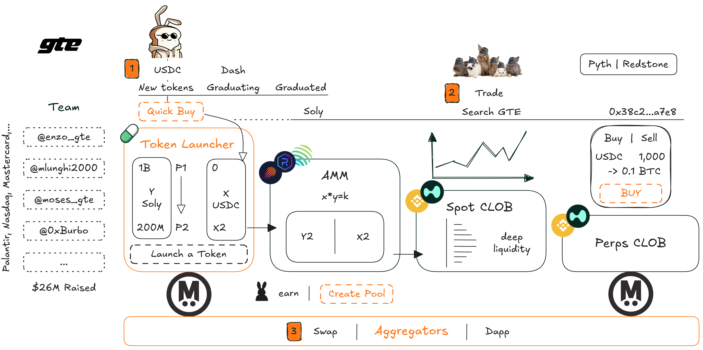

# DeFi

<figure><figcaption>
<a href="cap.md">CAP</a>
</figcaption></figure>

<figure><figcaption>
<a href="world-capital-markets.md">World Capital Markets</a>
</figcaption></figure>

<figure><figcaption>
<a href="avon.md">Avon</a>
</figcaption></figure>

<figure><figcaption>
<a href="noise.md">Noise</a>
</figcaption></figure>

<figure><figcaption>
<a href="euphoria.md">Euphoria</a>
</figcaption></figure>

<figure><figcaption>
<a href="gte.md">GTE</a>
</figcaption></figure>

<figure><figcaption>
<a href="valhalla.md">Valhalla</a>
</figcaption></figure>
