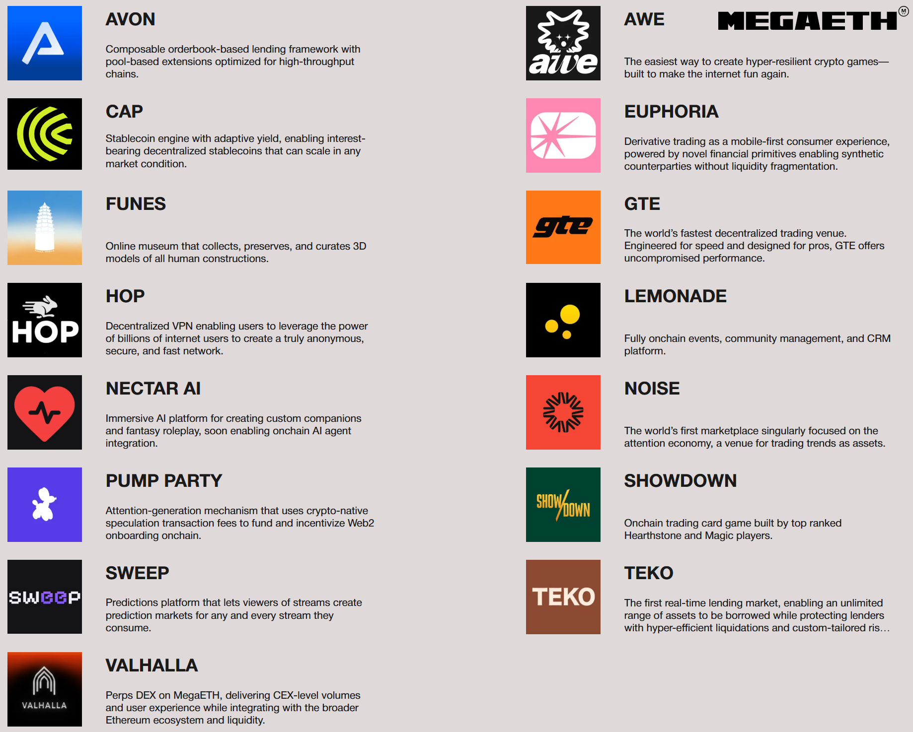

# Exploring

Ready to dive deeper into MegaETH? Here’s how to explore:

#### Exploring Projects

Discover how to explore MegaETH projects with a guide on [**Fluffle Tools Explore**](https://www.fluffle.tools/explore), created by [@0x\_ultra](https://x.com/0x_ultra/status/1903100994277474567). It’s your gateway to understanding and engaging with the ecosystem’s dApps and initiatives.

#### Discord Roles Explained

<figure><figcaption>
Check out this diagram by <a href="https://x.com/MarkoStevan19/status/1881688979638300713">@MarkoStevan19 </a>for a visual breakdown
</figcaption></figure>
