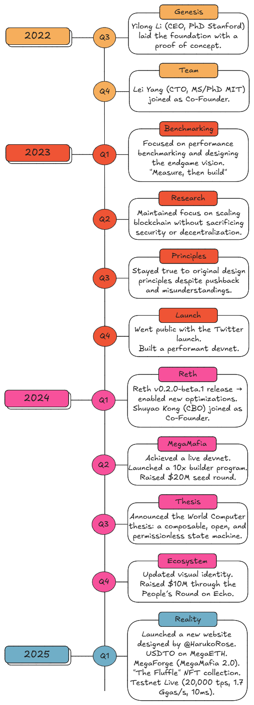

# Roadmap

### MegaETH Timeline

<figure><figcaption></figcaption></figure>

### MegaETH Roadmap: Turning Vision into Reality

**Past Events (2025)**

* **10/01/2025**: Launched new MegaETH website and domain.
* **24/01/2025**: Announced **MegaForge** (MegaMafia 2.0), an open, permissionless initiative ([Tweet 1](https://x.com/hotpot_dao/status/1878896282082615346) | [Tweet 2](https://x.com/megaeth_labs/status/1882829039603470371)).
* **05/02/2025**: Revealed **"The Fluffle"** NFT collection (10k soulbound NFTs, ≥5% network stake) ([Announcement](https://x.com/megaeth_labs/status/1886947683220234670) | [Website](https://www.megaeth.com/thefluffle)).
  * Minting in two 5k tranches: retroactive (completed **11-12/02**) and proactive (TBD).
* **03/03/2025**: Testnet announcement ([tweet](https://x.com/megaeth_labs/status/1896675119332045188)).
  * **06/03**: Testnet deployed.
  * **06-10/03**: Onboarded apps and infrastructure.
  * **Maintenance & Upgrades**:
    * **08, 12, 14, 16, 18 March**: Network tune-ups for stability and performance.
  * **21/03**: User onboarding with testnet ETH distribution ([tweet](https://x.com/megaeth_labs/status/1903099481874153880)).

**Future Events**

* **Current testnet:** Signature state trie / Streaming EVM / Efficient state sync. **Soon:** parallelization / JIT compilation / optimized storage backend ([Testnet Roadmap](https://testnet.megaeth.com/#2)).
* **21/03 - Mainnet** **Launch**: Minting of second 5k NFT tranche for proactive users.
* **Date TBD**: **MegaETH Mainnet** launch.

***

### MegaMafia Timeline

A visual representation of the timeline is **currently under construction**.🚧
