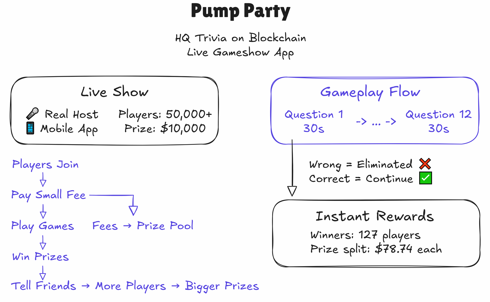
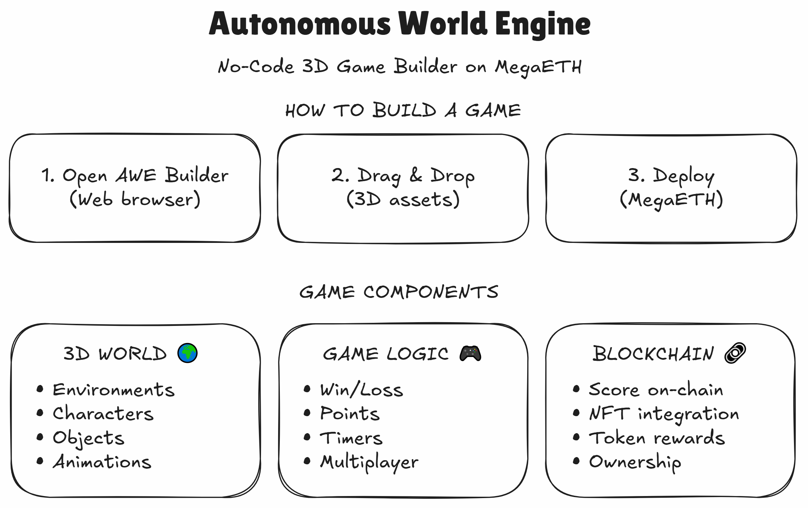

# Gaming & 3D

### Gaming

<figure><figcaption>
<a href="showdown.md">Showdown</a>
</figcaption></figure>

<figure><figcaption>
<a href="pump-party.md">Pump Party</a>
</figcaption></figure>

<figure><figcaption>
<a href="sweep.md">Sweep</a>
</figcaption></figure>

### 3D

<figure><figcaption>
<a href="awe.md">AWE</a>
</figcaption></figure>

<figure><figcaption>
<a href="funes.md">Funes</a>
</figcaption></figure>
