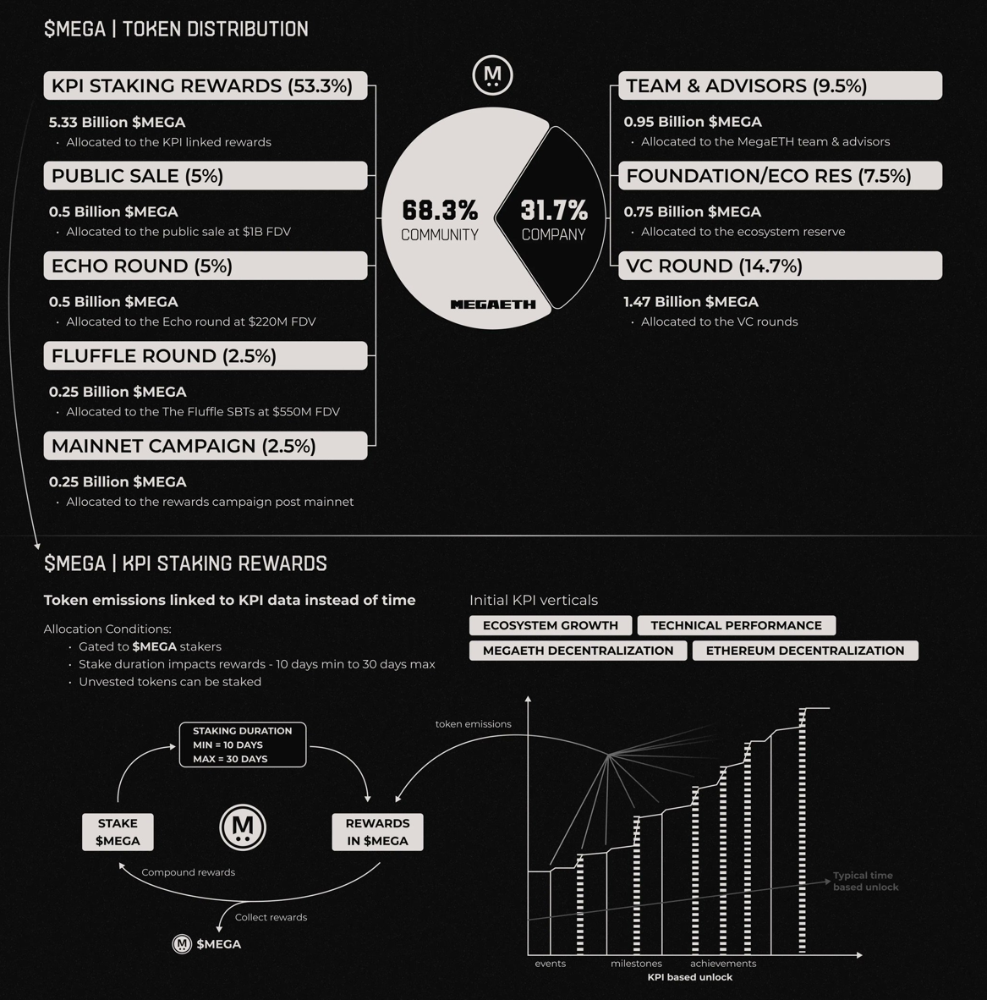

# Tokenomics

**$MEGA** is the native token of MegaETH, designed with protocol-level utility that directly supports the network's real-time performance and decentralization goals. The **community** is the [largest stakeholder](https://x.com/megaeth/status/1986429671890891017).

**Total Supply:** 10 billion $MEGA

#### Token Utility

$MEGA enables two core protocol features that optimize network performance and reward token holders:

**Sequencer Rotation**

MegaETH operates with **one active sequencer at a time**, rotating globally to follow the world's economic day across four key regions: Tokyo, Netherlands, Northern Virginia, and Los Angeles.

* Operators **stake $MEGA to compete** for sequencer selection in each time window
* Selection based on stake amount, past performance, and infrastructure quality
* **Faults are slashed** to maintain network reliability
* Ranked standbys provide instant failover for continuous operation
* End-to-end latency optimized for where users are most active

[Learn more](https://x.com/megaeth_labs/status/1981348518662197708)

**Proximity Markets**

Market makers and applications can **bid for sequencer-adjacent floor space** by locking $MEGA, enabling minimal latency for real-time order submission and confirmation.

* DeFi benefits from tighter spreads and deeper liquidity
* **Seats are bid on by locking $MEGA** - creating natural token demand
* Dynamic allocation based on demand, fully tokenized and transparent
* Onchain indexer streams real-time market data for instant reactions
* As colocation demand grows, so does demand for $MEGA

<figure><figcaption>
By <a href="https://x.com/Aizcalibur/status/1985717290613211619">@Aizcalibur</a>
</figcaption></figure>

#### Token Distribution

| Allocation              | Percentage | Details                                                   |
| ----------------------- | ---------- | --------------------------------------------------------- |
| **KPI Staking Rewards** | 53.3%      | Performance-based emissions to aligned stakers            |
| **Company**             | \~32%      | Team & advisors (9.5%), Foundation (7.5%) and VCs (14.7%) |
| **Echo Sale**           | 5%         | $220M FDV (December 2024)                                 |
| **Fluffle Holders**     | 2.5%       | $550M FDV (February 2025)                                 |
| **Public Sale**         | 5%         | $1B FDV (November 2025)                                   |
| **Mainnet Campaign**    | 2.5%       | Active ecosystem user rewards                             |

[Allocation Announcement](https://x.com/megaeth_labs/status/1981712585365020787) | [Learn more about community first approach](../guide/user-guide/hunting.md) | [4.75% Supply Buyback By MegaETH](https://x.com/megaeth/status/1979171136693731839)

#### KPI Staking Rewards

**Over half of total supply** (53.3%) is reserved for KPI-based distribution - a novel approach that **ties token emissions to network performance and adoption milestones**, not arbitrary time schedules.

**How It Works:**

* **Gated to $MEGA stakers** - only stakers receive KPI rewards
* **Time-weighted rewards** - stake duration impacts allocation (10-day minimum, 30-day maximum for full multiplier)
* **Unvested tokens can stake** - rewards follow original vesting lock terms
* **Compounding enabled** - claim and restake rewards to increase position
* **Sustainable emissions** - supply increases only as ecosystem hits key milestones

**KPI Verticals:**

Rewards unlock when the network achieves measurable targets across four key areas:

1. **Ecosystem Growth** - dApp adoption, user activity, TVL milestones
2. **Technical Performance** - Transaction throughput, latency benchmarks
3. **MegaETH Decentralization** - Sequencer rotation participation, geographic distribution
4. **Ethereum Decentralization** - Contribution to broader Ethereum ecosystem goals

All KPI metrics are **objective and onchain**, ensuring transparent and verifiable reward distribution.

[KPI Rewards Announcement](https://x.com/megaeth_labs/status/1981712581330121053)

***

**Key Takeaway:** $MEGA's tokenomics model prioritizes sustainable growth by linking emissions to measurable network success, ensuring that token distribution rewards genuine ecosystem contribution rather than passive holding.
